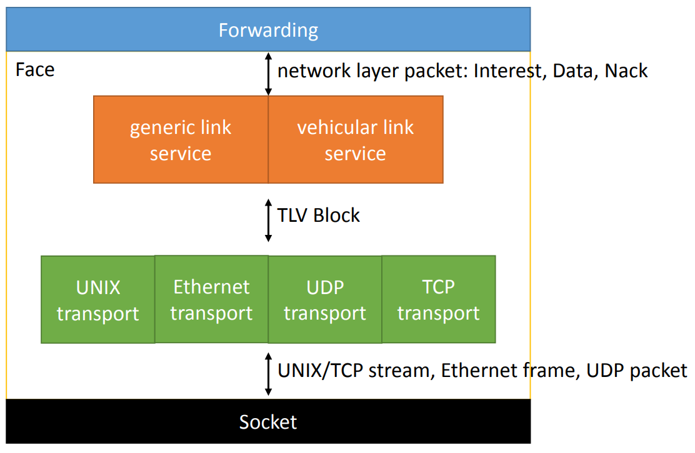
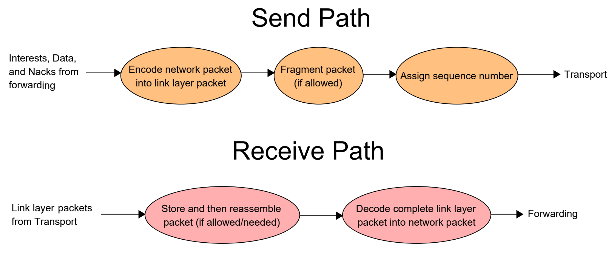
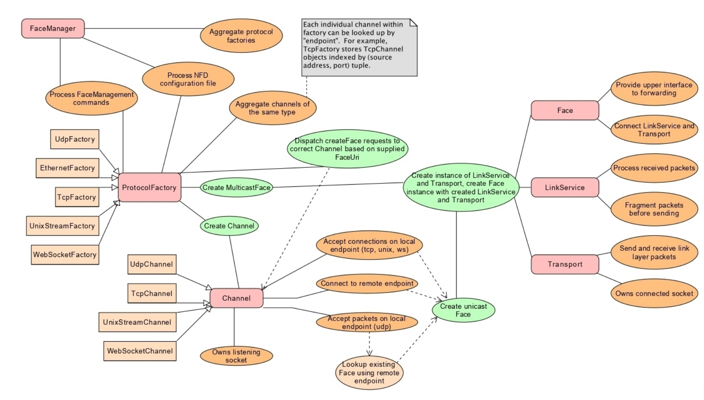

# NFD开发指南

## 1. 介绍

NDN转发守护程序（ *NFD* ）是一个网络转发器，它与命名数据网络（ *NDN* ）协议 [1] 一起实现和发展。 本文档介绍了NFD的内部结构，并且适合有兴趣扩展和改进NFD的开发人员。 有关NFD的其他信息，包括有关如何编译和运行NFD的说明，可在NFD主页上找到 [2] 。

**NFD的主要设计目标是支持NDN体系结构的各种实验**。 该设计强调 `模块化` （ *modularity* ） 和 `可扩展性` （ *extensibility* ），以便使用新协议功能，算法和应用程序进行实验。 我们尚未完全优化代码以提高性能，目的是性能优化是开发人员可以通过尝试不同的数据结构和不同的算法来进行的一种实验。随着时间的流逝，在相同的设计框架内可能会出现更好的实现。

NFD将在三个方面不断发展： **改进模块化框架** ， **符合NDN协议规范** 以及 **添加新功能** 。 我们希望保持模块化框架的稳定和精益，使研究人员能够实施和试验各种功能，其中某些功能最终可能会成为协议规范。

### 1.1 NFD模块

**NFD的主要功能是转发兴趣（ *Interest packet* ）和数据包（ *Data packet* ）** 。为了实现这个目的，它将底层的网络传输机制抽象到 *NDN Faces* 中，并维护诸如 *CS* 、 *PIT* 和 *FIB* 之类的基本数据结构，并实现数据包（ *packet* ）处理逻辑。 除了基本的数据包转发外，它还支持多种转发策略以及一个用于配置，控制和监视NFD的管理接口。 如下图1所示，NFD包含以下相互依赖的模块：

图1  NFD模块概览图

- **ndn-cxx Library, Core, and Tools** （第9节）

  这些库提供不同NFD模块之间共享的各种通用服务。 其中包括哈希计算例程，DNS解析器，配置文件， *Face* 监控和其他几个模块。

- **Faces**（第2节）

  在各种较低级别的传输机制之上实现 *NDN Face* 抽象。

- **Tables**（第3节）

  实现内容存储（ *CS*, Content Store ）、待定兴趣表（ *PIT*, Pending Interest Table ）、转发信息库（ *FIB*, Forwarding Information Base ）、策略选择（ *StrategyChoice* ）、测量（*Measurements*）和其他数据结构，以支持NDN数据包和兴趣包的转发。

- **Forwarding**（第4节）

  实现基本的数据包（ *packet* ）处理路径（ *processing pathways* ），该路径与 *Faces*、*Tables* 和 *Strategies* 模块交互（第5节）。策略是转发模块的主要部分，转发模块以转发管道的形式实现了一个框架，以支持不同的转发策略，有关详细信息，请参见第4节。

- **Management**（第6节）

  实现NFD管理协议 [3] ，该协议允许应用程序配置NFD并设置/查询NFD的内部状态。 协议交互是通过NDN在应用程序和NFD之间进行的兴趣/数据交换来完成的。

- **RIB Management**（第7节）

  本模块负责管理路由信息库（ *RIB*, Routing Information Base ）。  *RIB* 可以由不同方以不同方式进行更新，包括各种路由协议，应用程序前缀注册以及 *sysadmins* 进行的命令行操作。  *RIB* 管理模块处理所有这些请求以生成一致的转发表，并将其与NFD的FIB同步，该FIB仅包含转发决策所需的最少信息。

本文档的剩下部分将更详尽地描述所有这些模块。

### 1.2 在NFD中是如何处理数据包（ *packet* ）的

为了使读者更好地了解NFD的工作原理，本节介绍了如何在NFD中处理数据包。

数据包通过 *Faces* 到达NFD。 ***Face* 是广义的接口（ *Interface* ）**：

- 它可以是物理接口（ *physical interface* ）——NDN直接在以太网之上运行；
- 也可以是覆盖隧道（ *overlay tunnel* ）——NDN作为TCP，UDP或WebSocket之上的覆盖；
- 另外，NFD和本地应用程序之间的通信可以通过也是Face的Unix域套接字来完成。

*Face* 由 *LinkService* 和 *Transport* 组成。  *LinkService* 为 *Face* 提供高级服务，例如分片和重组，网络层计数器和故障检测，而Transport充当基础网络传输协议（TCP，UDP，以太网等）的包装，并提供链路层计数器之类的服务。Face通过操作系统API读取传入的流或数据报，从链路协议数据包中提取网络层数据包，并将这些网络层数据包（NDN数据包格式Interests，Datas或Nacks）传递给转发（ *Forwarding* ）模块。

网络层数据包（Interest，Data或Nack）由转发管道（ *forwarding pipelines* ）处理，转发管道定义了对数据包进行的一系列操作步骤。NFD的数据平面是有状态的，NFD对数据包的处理方式不仅取决于数据包本身，还取决于存储在表中的转发状态。

当转发器（ *Forwarder* ）接收到兴趣包（ *Interest packet* ）时，首先将其插入到兴趣表（ *PIT*， Pending Interest Table ）中，其中每个条目代表未决兴趣或最近满足的兴趣。在内容存储库（CS）上执行匹配数据的查找，内容存储库是数据包的网络内缓存。如果CS中有匹配的数据包，则将该数据包返回给请求者。 否则，该兴趣包需要被转发。

转发策略（ *forwarding strategy* ）决定了如何转发兴趣包。NFD允许按名称空间选择转发策略，它在包含策略配置的“策略选择”表上执行最长的前缀匹配查找，来确定使用哪个策略来转发兴趣包。转发策略将决定是否，何时以及在何处转发兴趣包（或更准确地说是PIT条目）。在使用某个策略作转发时，策略模块：

- 可以从转发信息库（FIB）中获取输入，该信息库包含来自本地应用程序的前缀注册和路由协议的路由信息；
- 还可以使用存储在PIT条目中的特定的策略信息；
- 也可以记录和使用存储在 *Measurements* 表项中的数据面的性能测量结果。

在策略模块决定将兴趣包转发到指定的 *Face* 后，该兴趣包将在转发管道（ *forwarding pipelines* ）中经过更多步骤，然后将其传递给 *Face* 。 *Face* 根据基础协议，在必要时将兴趣包分片，将网络层数据包封装在一个或多个链路层数据包中，然后通过操作系统 APIs 将链路层数据包作为输出流或数据报发送。

NFD对一个数据包（ *Data packet* ）到来的处理方式有所不同。它的第一步是检查兴趣表（PIT），以查看是否有此数据包可以满足的PIT条目，然后选择所有匹配的条目以进行进一步处理。 如果此数据包（ *Data packet* ）不能满足任何PIT条目，则它是未经请求的（ *unsolicited* ）并且将被丢弃。 否则，数据将添加到内容存储（ *CS* ）中，接着通知负责每个匹配的PIT条目的转发策略。通过此通知，以及另一个“无数据返回”超时，该策略能够观察路径的可访问性和性能。该策略可以在 *Measurements* 表中记住其观察结果，以改进其将来的决策。最后，将数据包（ *Data packet* ）发送给所有匹配的记录在PIT条目的下游记录中的请求者。通过 *Face* 发送数据包（ *Data packet* ）的过程类似于发送兴趣包（ *Interest packet* ）。

当转发器收到Nack时，处理过程将根据使用的转发策略（ *forwarding strategy* ）而有所不同。

### 1.3 NFD如何处理管理兴趣（ *Management Interests* ）

NFD管理协议（ *Management protocol* ） [3] 定义了三种基于兴趣包数据包交换的进程间管理机制：**`控制命令`**（ *control commands* ），**`状态数据集`**（ *status datasets* ）和**`通知流`**（ *notification streams* ）。 本节简要概述了这些机制的工作方式以及它们的要求。

**`控制命令`** （ *control commands* ）是已签名（已认证）的兴趣包，用于在NFD中执行状态更改。由于每个控制命令兴趣包的目标都是到达目的管理模块，而不是被内容缓存（CS）所满足，因此，通过使用时间戳（ *timestamp* ）和随机数（ *nonce* ）组件，可以使每个控制命令兴趣变得唯一。 有关更多详细信息，请参见控制命令规范 [4]。

NFD收到控制命令请求后，会将请求定向到一个被称为“内部 *Face* ”（ *Internal Face* ）的特殊 *Face* 。当请求转发到此Face时，它会在内部分配给指定的管理员（ *manager* ）。例如，以`/localhost/nfd/faces` 作为前缀的兴趣包会分配给Face管理员，请参见第6节。然后，管理员查看请求名称，以确定请求哪个操作。如果名称表示有效的控制命令，则调度程序（ *dispatcher* ）将验证命令（检查签名并验证请求者是否有权发送此命令），如果验证成功，则管理器将执行请求的操作。响应以数据包的形式发送回请求者，该数据包由转发和Face处理，其处理方式与常规数据相同。

>  *Internal Face* ：在FIB中始终有一个FIB条目匹配管理协议前缀，并指向 *Internal Face* （ *There is always a FIB entry for the management protocol prefix that points to the Internal Face.* ）

上述过程的一个例外是RIB管理（第7节），它是在单独的线程中执行的。 使用与转发到任何本地应用程序相同的方法，将所有RIB管理控制命令转发给RIB线程而不是 *Internal Face* （RIB线程在启动时会使用NFD为RIB管理前缀“注册”自身）。

**`状态数据集`** （ *status dataset* ）是包含定期或按需生成的NFD内部状态的数据集（例如NFD常规状态或NFD Face状态）。任何人都可以使用规范 [3] 中定义的针对特定管理模块的简单的没有签名的兴趣包（ *unsigned Interest* ）来请求这些数据集。请求状态数据集新版本的兴趣将转发到内部Face，然后以与控制命令相同的方式转发到指定的管理器。但是，管理器不会验证此兴趣，而是会生成请求数据集的所有的段（ *segments* ）并将其放入转发管道中。这样，数据集的第一部分将直接满足初始兴趣，而其他部分将通过CS满足后续兴趣。在不太可能发生的情况下，如果后续段在被提取之前已从CS中驱逐，则请求者负责从头开始重新启动提取过程。

**`通知流`** （ *notification streams* ）与状态数据集相似，因为任何人都可以使用未签名的兴趣来访问它们，但是操作方式不同。想要接收通知流的订户（ *Subscribers* ）仍将兴趣发送到指定的管理员。但是，这些利益将由调度员丢弃，并且不会转发给管理者。相反，无论何时生成通知，管理器都会将数据包放入转发中，以满足所有未完成的通知流的兴趣，然后将通知传递给所有订户。 预计这些兴趣将不会立即得到满足，并且订阅者将在到期时重新表达通知流兴趣。

## 2. Face 系统

*Face* 是广义的网络接口。与物理网络接口类似，可以在 *Face* 上发送和接收数据包。*Face* 比网络接口更通用。 它可能是：

- 物理网络接口以在物理链路上进行通信（ *a physical network interface to communicate on a physical link* ）；
- NFD与远程节点之间的覆盖通信通道（ *an overlay communication channel between NFD and a remote node* ）；
- NFD与本地应用程序之间的进程间通信通道（ *an inter-process communication channel between NFD and a local application* ）。

*Face* 为NDN网络层数据包提供尽力而为的传递服务。 *Forwarding* 可以通过 *Face* 发送和接收兴趣包（ *Interest packet* ），数据包（ *Data packet* ）和 Nack。 然后，该 *Face* 处理低层的通信机制（例如套接字），并对 *Forwarding* 隐藏不同底层协议的差异和细节。

第2.1节介绍了 *Face* 的语义，转发方式以及它的内部结构包括 *Transport* （第2.2节）和 *LinkService* （第2.3节）。 2.4节介绍了 *Face* 的创建和组织方式。

### 2.1 Face

NFD作为网络转发器，在网络接口之间移动数据包。NFD不仅可以在物理网络接口上进行通信，还可以在各种其他通信通道上进行通信，例如TCP和UDP上的覆盖隧道。因此，我们将“网络接口”泛化为“Face”，从而抽象了NFD可用于数据包转发的通信通道。*Face* 抽象（nfd :: Face类）为NDN网络层数据包提供尽力而为的传递服务。*Forwarding* 可以通过 *Face* 发送和接收兴趣包（ *Interest packet* ），数据包（ *Data packet* ）和 Nack。 然后，该 *Face* 处理低层的通信机制（例如套接字），并对 *Forwarding* 隐藏不同底层协议的差异和细节。

在NFD中，NFD与本地应用程序之间的进程间通信通道也被视为 *Face* 。 这不同于传统的 TCP/IP 网络栈，在传统的 TCP/IP 网络栈中，本地应用程序使用syscall与网络栈进行交互，而网络数据包仅存在于线路上。NFD能够通过 *Face* 与本地应用程序进行通信，因为网络层的数据包格式与线路上的数据包相同。对本地应用程序和远程主机使用统一的 *Face* 抽象可以简化NFD体系结构。

**Forwarding 如何使用 Face的？** `FaceTable` 类是 *Forwarding* 的一部分，它跟踪所有活动的 *Face* 。 新创建的 *Face* 将传递给 `FaceTable::add`，这个函数为传入的 *Face* 分配一个数字 *FaceId* 用于识别。 关闭 *Face* 后，将其从 *FaceTable* 中删除。*Forwarding* 通过连接到`afterReceiveInterest`、`afterReceiveData`和`afterReceiveNack`信号来从 *Face* 接收数据包，此操作在 *FaceTable* 中完成。 *Forwarding* 可以通过调用`sendInterest`、`sendData`和`sendNack`方法来通过 *Face* 发送网络层数据包。

**Face 的属性** => *Face* 公开了一些属性以显示其状态并控制其行为：

- **`FaceId`** 是一个数字ID，用于区分不同的 *Face* ，*FaceTable* 为它分配了一个非零值，并且当从 *FaceTable* 中删除 *Face* 时将其清除；
- **`LocalUri`** 是一个 `FaceUri`（第2.2节），代表本地端点（ *endpoint* ），该属性是只读的；
- **`RemoteUri`** 是一个`FaceUri`（第2.2节），代表远程端点，该属性是只读的；
- **`Scope`** 指示 *Face* 是否出于范围控制目的而位于本地，它可以是非本地的（ *non-local* ）或本地的（ *local* ），该属性是只读的；
- **`Persistency`** 控制当基础通信通道中发生错误或 *Face* 闲置了一段时间后系统的行为：
  - `on-demand`：设置为 *on-demand* 的 *Face* 保持空闲一段时间或在基础通信通道中发生错误，则它会关闭；
  - `persistent`：设置为 *persistent* 的 *Face* 会一直保持打开状态，直到被明确销毁，或者基础通信渠道发生错误；
  - `permanent`：设置为 *permanent* 的 *Face* 会一直保持打开状态，直到被明确销毁为止； 基础通信通道中的错误在内部得以恢复。
- **`LinkType`** 指示通信链接的类型，它可以是点对点或多路访问，该属性是只读的；
- **`State`** 指示 *Face* 的当前可用性：
  - *`UP`* ：*Face* 正常工作
  - *`DOWN`* ：*Face* 暂时处于 *down* 的状态，正在恢复，可以发送数据包，但是不太可能发送成功
  - *`CLOSING`* ：*Face* 正在关闭
  - *`FAILED`* ：*Face* 由于发生错误而关闭
  - *`CLOSED`* ：*Face* 已经关闭
- **`Counters`** 提供有关在 *Face* 上发送和接收的兴趣包、数据包、Nack的以及较低层数据包的数量和大小的统计信息。

图2  Face = LinkService + Transport

**内部结构（ *Internal structure* ）** ：在内部，*Face* 由 *LinkService* 和 *Transport* 组成（图2）。*Transport* （第2.2节）是 *Face* 较底层的部分，包裹了底层的通信机制（例如套接字或libpcap句柄），并为 *Face* 提供尽力而为的TLV数据包传递服务。*LinkService* （第2.3节）是 *Face* 较上层的部分，它在网络层数据包和较低层数据包之间进行转换，并提供其他服务，例如分片、链路故障检测和重传。*LinkService* 包含一个分片器（ *fragmentation* ）和一个重组器（ *reassembly* ），以允许它执行分片和重组。

*Face* 被实现为`nfd::face::Face` 类。 Face类被设计为不可继承的（单元测试除外），并且传递给其构造函数的 *LinkService*  和 *Transport* 完全定义了其行为。在构造函数中， *LinkService*  和 *Transport* 都被赋予了指向彼此和指向 *Face* 的指针，因此它们可以以最低的运行时开销相互调用。

接收和发送的数据包在传递到 *forwarding* 或在链路上发送之前分别通过 *LinkService*  和 *Transport* 。 *Transport* 收到数据包后，将通过调用`LinkService::receivePacket`函数将其传递到 *LinkService* 。当通过 *Face* 发送数据包时，它首先通过特定于数据包类型的函数（`Face::sendInterest`、`Face::sendData`或`Face::sendNack`）传递给 *LinkService* 。处理完数据包后，将通过调用`Transport::send`函数将其传递，或者如果已分片，则将其碎片传递到 *Transport* 。在 *LinkService* 和 *Transport* 中，使用远程端点ID（`Transport::EndpointId`）标识远程端点，该ID是64位无符号整数，其中包含每个远程主机的协议特定的唯一标识符。

### 2.2 Transport

**Transport**（基类为`nfd::face::Transport`）为 *Face* 的 LinkService 提供尽力而为的数据包传递服务。*LinkService* 可以调用`Transport::send`发送数据包。数据包到达时，将调用`LinkService::receivePacket`。 **每个数据包必须是完整的TLV块** ； 传输不对此块的TLV-TYPE进行任何假设。 另外，每个接收到的数据包都附带一个EndpointId，该EndpointId指示此数据包的发送方，这对于片段重组，故障检测以及多路访问链路上的其他目的很有用。

**Transport 属性** ：*Transport* 提供`LocalUri`、`RemoteUri`、`Scope` 、`Persistency`、`LinkType`和`State`属性，它还在输入和输出方向上维护较低层的数据包计数器和字节计数器。 这些属性和计数器可以通过 *Face* 访问。

如果将 *Transport* 的 `persistency` 属性设置为 *permanent* ，则 *Transport* 将负责采取必要的操作以从潜在故障中恢复。例如：UDP传输应忽略套接字错误。如果先前的连接已关闭，则TCP传输应尝试重新建立TCP连接。这种恢复的进度反映在 `State` 属性中。

此外，传输提供了以下属性供 *link service* 使用：

- **`Mtu`** 指示可以通过此传输发送或接收的最大数据包大小。它可以是正数，也可以是特殊的值 `MTU UNLIMITED`，表示对数据包大小没有限制。该属性是只读的。*Transport* 可以随时更改此属性的值，并且 *link service* 应为此做好准备。

**FaceUri** ：`FaceUri` 是一个URI，代表传输所使用的端点或通信通道。它以一个指示基础协议（例如udp4）的 *scheme* 开头，然后是基础地址的 *scheme* 特定表示。在`LocalUri`和`RemoteUri`属性中使用。

本节的其余部分描述了用于不同基础通信机制的每个单独传输，包括其`FaceUri`格式，实现细节和功能限制。

#### 2.2.1 Internal Transport

内部传输（`nfd::face::InternalForwarderTransport`）是与内部客户端传输（`nfd::face::InternalClientTransport`）配对的传输。 在内部转发器传输上传输的数据包在配对的客户端传输上被接收，反之亦然。 这主要用于与NFD *management* 进行通信； 这也用于实现TopologyTester（第10.1.3节）以进行单元测试。

#### 2.2.2 Unix Stream Transport

*Unix stream transport*（`nfd::face::UnixStreamTransport`）是一种在面向流的Unix域套接字上进行通信的传输。

> `Unix domain socket` 是是基于`Socket API`的基础上发展而来的，`Socket API`原本适用于不同机器上进程间的通讯，当然也可用于同一机器上不同进程的通讯（通过localhost），后来在此基础上，发展出专门用于进程间通讯的IPC机制，UDS与原来的网络Socket相比，仅仅只需要在进程间复制数据，无需处理协议、计算校验和、维护序号、添加和删除网络报头、发送确认报文，因此更高效，速度更快。UDS提供了和TCP/UDP类似的流和数据包，但这两种都是可靠的，消息不会丢失也不会乱序。 => 参考：[Unix domain socket(UDS)](https://www.jianshu.com/p/dc78b7ca006a)

NFD在指定的套接字上通过`UnixStreamChannel`监听传入的连接，该套接字的路径由`face_system.unix.path`配置选项指定。为每个传入连接创建一个UnixStreamTransport。NFD不支持建立传出Unix流连接。

Unix流传输的静态属性有：

- **`LocalUri`** ：`unix://path `，其中 *path* 为socket文件的路径，例如：`unix:///var/run/nfd.sock`
- **`RemoteUri`** ：`fd://file-descriptor`，其中 *file-descriptor* 是NFD进程中 *accepted socket* 的文件描述符
- **`Scope`** ：*local*
- **`Persistency`** ：固定为 *on-demand* ，不允许配置为其它值
- **`LinkType`** ： *point-to-point*
- **`Mtu`** ：*unlimited*

`UnixStreamTransport`派生自`StreamTransport`，该 *Transport* 用于所有基于流的传输，包括Unix流和TCP。 `UnixStreamTransport`的大多数功能由`StreamTransport`处理。这样，当`UnixStreamTransport`收到超过最大包大小或无效的包时，传输进入失败状态并关闭。

接收到的数据存储在缓冲区中，当前缓冲区中的数据量也已存储。每次接收时，传输都会处理缓冲区中的所有有效数据包（ *packet* ）。 然后，该 *UnixStreamTransport* 将任何剩余的八位位组（ *[octets](https://baike.baidu.com/item/%E5%85%AB%E6%AF%94%E7%89%B9%E7%BB%84/5920941?fr=aladdin)* ）复制到缓冲区的开头，并等待更多的八位位组，将新的八位位组追加到现有八位位组的末尾。

#### 2.2.3 Ethernet Transport

*Ethernet Transport*（`nfd::face::EthernetTransport`）是直接在以太网上进行通信的传输。

以太网传输当前仅支持多播。**在初始化或重新加载配置时，NFD会在每个支持多播的网络接口上自动创建以太网传输**。要禁用以太网多播传输，请在NFD配置文件中将`face_system.ether.mcast`选项更改为“ no”

在NFD配置文件中的`face_system.ether.mcast`组选项上指定了多播组。必须将同一以太网段上的所有NDN主机配置为相同的多播组，以便彼此通信。 因此，建议保留默认的多播组设置。

*Ethernet Transport* 的静态属性包含：

- **`LocalUri`** ：`dev://ifname`，其中，`ifname`为网络接口的名字，例如：`dev://eth0`
- **`RemoteUri`** ：`ethet://[ethernet-addr]`，其中，*ethernet-addr* 是多播组，例如：`ether://[01:00:5e:00:17:aa]`
- **`Scope`** ：*non-local*
- **`Persistency`** ：固定为*permanent*，不允许配置为其它值
- **`LinkType`** ：*multi-access*
- **`Mtu`** ：即为物理网络接口的 *MTU*

`EthernetTransport`使用 *libpcap* 句柄在以太网链路上进行发送和接收。通过激活接口来初始化句柄，然后，将链路层标头格式设置为EN10MB（该值标识生成的为以太网包），并将libpcap设置为仅捕获传入的数据包。句柄初始化之后，传输将设置一个数据包筛选器以仅捕获发送到多播地址的NDN类型（0x8624）的数据包。通过使用SIOCADDMULTI将地址直接添加到链路层多播过滤器，可以避免使用混杂模式。但是，如果失败，则接口可以退回到混杂模式。

具体实现里将libpcap句柄与Boost Asio结合使用，在Asio提供的 `async_read_some` 中调用读取处理函数（ *read handle* ），然后在读取处理函数里面具体使用libpcap句柄收包。如果收到超大或无效的数据包，则将其丢弃。

每个以太网链路都是自然支持多播通信的广播介质。尽管可以将这种广播媒体用作许多点对点链接，但这样做会失去NDN的本机多播优势，并增加NFD主机的工作量。因此，我们决定最好仅将以太网链接用作多路访问，并且不支持以太网单播。

#### 2.2.4 UDP单播传输（UDP unicast Transport）

*UDP unicast transport* （`nfd::face::UnicastUdpTransport`）是一种通过IPv4或IPv6在UDP隧道上进行通信的传输。

NFD通过`face_system.udp.port`配置选项指定的端口号通过`UdpChannel`监听传入的数据报。为每个新的远程端点创建一个`UnicastUdpTransport`。NFD还可以创建传出（ *outgoing* ）UDP单播传输。

UDP单播传输的静态属性包含：

- **`LocalUri`** 和`RemoteUri`
  - IPv4 `udp4://ip:port` ，例如 `udp4://192.0.2.1:6363`
  - IPv6 `udp6://ip:port` ，其中，*ip* 为小写字母，并用方括号括起来，例如：`udp6://[2001:db8::1]:6363`
- **`Scope`** ：*non-local*
- **`Persistency`** ：从接受的套接字（ *accepted socket* ）创建的按需（ *on-demand* ）传输，为传出连接创建的传输则为持久（ *persistent* ）或永久（ *permanent* ），传输中允许更改持久性设置，但当前在`FaceManager`中禁止更改
- **`LinkType`** ：*point-to-point*
- **`Mtu`** ：最大IP长度减去IP和UDP包头

`UnicastUdpTransport`派生自`DatagramTransport`。这样，它是通过将现有的UDP套接字添加到传输中来创建的。

单播UDP传输依赖IP分片，而不是将数据包适配到基础链路的MTU。 由于中间路由器能够根据需要对数据包进行分片，因此这允许数据包遍历具有较低MTU的链接。 通过阻止在传出数据包上设置“不分片（DF）”标志来启用IP分片。 在Linux上，这是通过禁用PMTU发现来完成的。

当传输接收到太大或不完整的数据包时，该数据包将被丢弃。 如果设置了非零的空闲超时，则具有按需持久性的单播UDP传输将超时。

除非具有永久持久性，否则单播UDP传输将因ICMP错误而失败。 但是，选择永久性持久性时，是没有 *UP/DOWN* 过渡的，需要使用尝试多个 *Face* 的策略。

#### 2.2.5 UDP多播传输（UDP multicast Transport）

*UDP multicast transport* （`nfd::face::MulticastUdpTransport`）是在UDP多播组上进行通信的传输。

在初始化或重新加载配置时，NFD会在每个支持多播的网络接口上自动创建UDP多播传输。要禁用UDP多播传输，请在NFD配置文件中将`face_system.udp.mcast`选项更改为“ no”。

UDP多播传输当前仅支持单跳上的IPv4多播。由于仅在单跳上支持UDP多播通信，并且几乎所有平台都支持IPv4多播，IPv6多播没有用例，因此不支持。在NFD配置文件中的`face_system.udp.mcast`组和`face_system.udp.mcast`端口选项上指定了多播组和端口号。必须将同一IP子网上的所有NDN主机配置为相同的多播组，以便彼此通信。因此，建议保留默认的多播组设置。

UDP多播传输的静态属性包含：

- **`LocalUri`**：`udp4://ip:port`，例如：`udp4://192.0.2.1:56363`
- **`RemoteUri`**：`udp4://ip:port`，例如：`udp4://224.0.23.170:56363`
- **`Scope`**：*non-local*
- **`Persistency`**：*permanent*
- **`LinkType`**：*multi-access*
- **`Mtu`**：最大IP长度减去IP和UDP包头

`MulticastUdpTransport`派生自`DatagramTransport`。传输使用两个单独的套接字，一个用于发送，一个用于接收。这些功能在套接字之间相互分离，以防止将发送的数据包循环回发送套接字。

#### 2.2.6 TCP Transport

*TCP Transport* （`nfd::face::TcpTransport`）是一种通过IPv4或IPv6在TCP隧道上进行通信的传输。

NFD通过`face_system.tcp.port`配置选项指定的端口号通过TcpChannel监听传入的连接。为每个传入连接创建一个`TcpTransport`。NFD还可以建立传出TCP连接。

TCP传输的静态属性包含：

- **`LocalUri`** 和 **`RemoteUri`**
  - IPv4 `tcp4://ip:port`，例如：`tcp4://192.0.2.1:6363`
  - IPv6 `tcp6://ip:port`，其中，*ip* 为小写字母，并用方括号括起来，例如：`tcp6://[2001:db8::1]:6363`
- **`Scope`**：如果远程端点使用的是回环IP（*localhost* 、*127.0.0.1* ），则为 *local* ，否则为 *non-local*
- **`Persistency`**：从接受的套接字（ *accepted socket* ）创建按需传输（ *on-demand* ），为传出连接创建持久（ *persistent* ）传输，允许在按需和持久之间切换，永久性（ *permanent* ）未实现，但将来会得到支持
- **`LinkType`**：*point-to-point*
- **`Mtu`**：*unlimited*

与`UnixStreamTransport`一样，`TcpTransport`也是从`StreamTransport`派生的，因此可以在`UnixStreamTransport`部分（第2.2.2节）中找到它的其他详细信息。

#### 2.2.7 WebSocket Transport

为了提高可靠性，**WebSocket** 在TCP之上实现了基于消息的协议。 WebSocket是许多Web应用程序用来维持与远程主机的长连接的协议。 **NDN.JS** 客户端库使用它在浏览器和NDN转发器之间建立连接。

NFD通过`face_system.websocket.port`配置选项指定的端口号通过`WebSocketChannel`侦听传入的WebSocket连接。该通道通过未加密的HTTP以及根路径（即`ws://<ip>:<port>/`）进行侦听； 您可以部署前端代理以启用TLS加密或更改侦听器路径（`wss://<ip>:<port>/<path>`）。 为每个传入连接创建一个`WebSocketTransport`。NFD不支持传出WebSocket连接。

WebSocket传输的静态属性包含：

- **`LocalUri`**：`ws://ip:port`，例如：`ws://192.0.2.1:9696`、`ws://[2001:db8::1]:6363`
- **`RemoteUri`**：`wsclient://ip:port`，例如：`ws://192.0.2.2:54420`、`ws://[2001:db8::2]:54420`
- **`Scope`**：如果远程端点使用的是回环IP（*localhost* 、*127.0.0.1* ），则为 *local* ，否则为 *non-local*
- **`Persistency`**：*on-demand*
- **`LinkType`**：*point-to-point*
- **`Mtu`**：*unlimited*

WebSocket对NDN数据包的封装`WebSocketTransport` **在每个WebSocket帧中期望恰好一个NDN数据包或LpPacket。包含不完整或多个数据包的帧将被丢弃，事件将由NFD记录** 。 客户端应用程序（和库）不应将此类数据包发送到NFD。例如，Web浏览器中的JavaScript客户端应始终将完整的NDN数据包馈入`WebSocket.send()`接口。

`WebSocketTransport`是使用 *websocketpp* 库实现的。

`WebSocketTransport`和`WebSocketChannel`之间的关系比大多数传输通道关系更紧密。这是因为消息是通过通道传递的。

#### 2.2.8 开发一种新的Transport

可以通过首先创建一个新的传输类来创建新的传输类型，该类可以从`StreamTransport`和`DatagramTransport`模板类之一特化（ *specializing* ）得到，或者从Transport基类继承。如果新的传输类型是直接从Transport基类继承的，那么您将需要实现一些虚拟函数，包括`beforeChangePersistency`，`doClose`和`doSend`，此外，还需要在构造函数中设置静态属性（`LocalUri`、`RemoteUri`、`Scope`、`Persistency`、`LinkType`和`Mtu`）。在需要的时候，您也可以设置传输状态和ExpirationTime。

当特化（ *specializing* ）传输模板时，某些上述任务将由模板类处理。根据模板，您可能需要实现的只是构造函数和`beforeChangePersistency`函数，以及任何所需的辅助函数。 但是，请注意，您仍然需要在构造函数中设置传输的静态属性。

### 2.3 链路服务（Link Service）

***Link service*** （基类为`nfd::face::LinkService`）在 *Transport* 之上工作，并提供尽力而为的网络层数据包传递服务。***Link service* 必须在网络层数据包（*Interest* 、*Data* 和 *Nack* ）和链接层数据包（TLV块）之间转换**。另外，可以提供附加的链路服务，以弥合转发的需求和基础传输能力之间的差距。例如，如果基础传输具有最大传输单元（MTU）限制，则需要分片和重组以便发送和接收大于MTU的网络层数据包；如果基础传输的丢失率很高，则可以启用每链路重传（ *per-link retransmission* ）以减少丢失并提高性能。

#### 2.3.1 通用链路服务（Generic Link Service）

***Generic link service*** （`nfd::face::GenericLinkService`）是NFD默认的服务，它的链路层数据包的格式为NDNLPv2 [5]。

NFD 从0.4.0开始，已经实现了以下功能：

- Interest、Data和Nack 的编解码

  Interest、Data和Nack 现在封装在`LpPackets`中（通用链接服务每个LpPacket仅支持一个网络层数据包或片段）。 LpPackets包含包头字段和一个片段，这允许逐跳信息与ICN信息分开。

- 碎片和重组（索引碎片）

  Interest和Data可以分片并逐跳重组，以允许遍历具有不同MTU的链接。

- 消费者控制的转发（`NextHopFaceId`字段）

  消费者可以使用`NextHopFaceId`字段指定在连接的转发器上应该从哪个 *Face* 发送兴趣包。

- 本地缓存策略（`CachePolicy`字段）

  `CachePolicy`字段使生产者可以指定一个策略，该策略决定是否应当应缓存数据。

- 传入 *Face* 指示（`IncomingFaceId`字段）

  可以将`IncomingFaceId`字段附加到`LpPacket`，以通知本地应用程序该数据包是从哪个 *Face* 传入的。

还有一些下列计划将来实现的功能：

- 故障检测（类似于BFD [6]）
- 链路可靠性提高（重复请求，类似于ARQ [7]）

具体启用哪些服务取决于传输类型：

|              | Fragmentation | Local Fields (NextHopFaceId, CachePolicy, IncomingFaceId) |
| ------------ | :-----------: | :-------------------------------------------------------: |
| Internal     |               |                             √                             |
| UnixStream   |               |                             *                             |
| Ethernet     |       √       |                                                           |
| UnicastUdp   |       √       |                                                           |
| MulticastUdp |       √       |                                                           |
| Tcp          |               |                             *                             |
| WebSocket    |               |                                                           |

> 上表中 \* 号表示当具有本地范围时，可以在这些传输类型上启用 *Local Fields* 。 可以通过enableLocalControl管理命令启用它们（请参见6.4节）。

如果启用了数据包分片（ *fragmentation* ）功能并且链接的MTU受到限制，则链接服务（ *link service* ）会将封装在链接层数据包中的网络层数据包提交给分片器（ *fragmenter* ）。分片器的具体实现将在下面的单独部分中讨论。链接服务将每个分片交给 *Transport* 进行传输，如果未启用分片或链路具有无限的MTU，则将序列号（ *sequence* ）分配给数据包，并将其传递到传输器进行传输。

当在另一端接收到链路层数据包时，该数据包将从 *Transport* 传递到链路服务（ *link service* ）。如果未在接收链接服务上启用分片，则将检查接收到的数据包的FragIndex和FragCount字段，如果包含它们则丢弃。然后将数据包提供给重组器（ *reassembler* ），重组器返回重组的数据包，但前提是接收到的片段已完成该数据包。然后将重组后的数据包解码并传递给 *Forwarding* 。否则，将不会进一步处理收到的片段。

**通用链接服务（ *Generic Link Service* ）中的数据包分片和重组**：通用链接服务使用给数据包分片添加添加索引来实现分片（在2.5节中有更详细的描述）。

- **发送端链接服务具有分片器（ *fragmenter* ）**，分片器返回封装在链路层数据包中的分片向量。如果数据包的大小小于MTU，则分片程序返回一个仅包含一个数据包的向量。链接服务为每个片段分配一个连续的序列号，如果有多个片段，则在每个片段中插入一个FragIndex和FragCount字段。FragIndex是片段相对于网络层数据包的从0开始的索引，而FragCount是从数据包产生的片段总数。
- **接收链接服务有一个重组器（ *reassembler* ）**，重组器根据一个基于远程端点ID（请参见“Face - Internal Structure”-2.1）和数据包中第一个片段的序列号组合得到的键（ *key* ），使用 *map* 来跟踪接收到的片段。如果完成，它将返回重新组装的数据包。重组器还管理不完整数据包的超时，并在接收到第一个片段时设置丢弃计时器。收到数据包的新片段后，将重置该数据包的丢弃计时器。

图3  通用链路服务的内部结构

#### 2.3.2 车辆链路服务（Vehicular Link Service）

车辆链路服务（ *Vehicular Link Service* ）是一个计划实现的功能，用于实现适用于车辆网络的链路服务。

#### 2.3.3 开发一种新的链路服务

链接服务（ *link service* ）可以为 *Face* 提供许多服务，因此新的链接服务需要处理许多任务。至少，链接服务必须对传出的兴趣，数据和漏洞进行编码和解码。但是，根据新链接服务的预期用途，除任何其他需要的服务之外，还可能有必要实现诸如分段和重组，本地字段和序列号分配之类的服务。

### 2.4 Face管理器、协议工厂和渠道（Face Manager, Protocol Factories, and Channels）

NFD使用`FaceManager`来组织人脸，后者可以控制各个协议工厂（ *protocol factories* ）和通道（ *channels* ）。

`FaceManager`（在第6.4节中详细介绍）管理 *Face* 的创建和销毁。 *Face* 是通过其协议专用工厂创建的（如下所述）。

协议工厂管理特定协议类型的通道（单播）和多播 *Face* 。`ProtocolFactory`的子类需要实现`createFace`和`getChannels`虚函数。除了任何特定于协议的功能之外，还可以可选地实现`createChannel`，`createMulticastFace`和`getMulticastFaces`函数。

通道（ *channels* ）侦听并处理传入的单播连接，并为特定本地端点（ *local endpoint* ）建立传出单播连接。这些动作中的任何一个成功都会产生 *Face* 。 调用`createChannel`函数时，由协议工厂创建通道。一旦一个新 *Face* 被创建，不管是传入还是传出的，都将调用指定的回调函数`FaceCreatedCallback`。 如果 *Face* 面部失败，则将调用`FaceCreationFailedCallback`。侦听套接字（或在WebSocket中为WebSocket服务器句柄）的所有权属于单个通道。连接到远程端点的套接字为与相关 *Face* 相关联的 *Transport* 所拥有，但对于WebSocket而言，所有 *Face* 均使用相同的服务器句柄。请注意，没有以太网通道，因为NFD中的以太网链接仅是多播。

*Face* 需要规范的 *Face URI* ，而不是执行DNS解析，因为后者会在 *Face* 系统中造成不必要的开销。 DNS解析可以改为由外部库和实用程序执行，将解析后的规范 *Face URI* 提供给NFD。

#### 2.4.1 根据配置创建Face

创建通道（ *Channel* ）和多播 *Face* 的一种方法是来自配置文件。为了创建这些 *Face* 和 *Channel* ，`FaceManager`处理配置文件的`face_system`部分。对于文件中的每种协议类型，`FaceManager`都会创建一个协议工厂（如果尚不存在）。然后，`FaceManager`指导适当的工厂为每个启用的协议创建通道，具体取决于配置部分中的选项。 对于同时支持IPv4和IPv6的协议，如果启用，`FaceManager`可以指示工厂为它们创建一个通道。对于UDP和以太网等多播协议，如果启用了多播和其他相关选项，则`FaceManager`指示工厂在每个接口上创建一个多播 *Face* 。

#### 2.4.2 使用命令行工具创建Face

可以创建 *Face* 的另一种方法是使用 *faces / create* （`nfd face create`）命令。收到此命令后，NFD会在`FaceManager`中调用`createFace`函数。此命令解析提供的 *Face URI* 并从中提取协议类型。协议工厂存储在映射中，按协议类型排序。创建 *Face* 时，`FaceManager`通过从提供的 *Face URI*  解析协议类型来确定要使用的正确协议工厂。如果找不到匹配的协议工厂，则命令失败。否则，它将在相对应的协议工厂中调用`createFace`函数来创建 *Face* 。

### 2.5 NDNLP

NDN链接协议（ *NDN Link Protocol* v2）在 *forwarding* 与基础网络传输协议和系统（例如TCP，UDP，Unix套接字和以太网）之间提供了链接协议。它给 *forwarding* 的链接服务（ *link service* ）提供统一的接口，并在这些服务和基础网络层之间提供桥梁。通过这种方法，上层可以忽略这些底层的特定特征和机制。另外，链接协议提供每种链接类型共有的服务，具体实现因链接类型而异。链接服务还指定了通用的TLV链接层数据包格式。NDNLP当前提供的服务包括分片（ *fragmentation* ）和重组（ *reassembly* ），否定确认（ *Nacks* ），消费者控制的转发，高速缓存策略控制，以及向应用程序提供有关数据包传入 *face* 的信息。未来计划的功能包括链路故障检测（BFD）和ARQ。这些功能可以单独启用和禁用。

图4  FaceManager，Channel，ProtocolFactory和Face交互

在NFD中，链接协议（ *Link Protocol* ）是在`LinkService`中实现的。 该链接协议替代了NDN链接协议（NDNLPv1）的先前版本[8]。

下面是对链接协议提供的每个功能的描述：

- **分片和重组（ *fragmentation and reassembly* ）**

  分片和重组是使用索引分段（ *indexed fragmentation* ）逐跳完成的。对数据包进行分段，并为其分配一个`FragIndex`字段和一个`FragCount`字段，其中`FragIndex`指示分片的数据包中从零开始的索引，而`FragCount`代表该数据包的碎片总数。与网络层数据包关联的所有链路层包头仅附加到第一个片段上，其他不相关的链路层包头可以“搭载”在任何片段上。 接收者使用每个片段中的`FragIndex`和`FragCount`字段来重组完整的数据包。

- **否定确认（ *Nacks* ）**

  否定确认是向下游发送的消息，用于指示转发器（ *forwarder* ）无法满足特定的兴趣。相关的兴趣包含于 *Nack* 的 `Fragment` 域中。Nack本身由数据包中的Nack头字段指示（ *如果某个兴趣包的 Nack 字段有效，则标识这个是一个 Nack 包* ）。

  *Nack* 可以选择包含`NackReason`字段（在Nack字段下），以指示转发器（ *forwarder* ）为何无法满足兴趣。 这些原因包括链路上的拥塞，检测到重复的Nonce，以及没有与兴趣匹配的路由。

- **消费者控制的转发（ *consumer-controlled forwarding* ）**

  消费者控制的转发允许应用程序指定应该从哪个指定的 *face* 将兴趣包发送出去。可以使用`NextHopFaceId`包头指示，该包头包含本地转发器上消费者指定用来发包的 *face* 接口的 *face* ID。

- **缓存策略控制（ *cache policy control* ）**

  通过缓存策略控制，生产者可以指示应是否应当缓存数据。这是通过包头中`CachePolicy`包头完成的，该包头包含`CachePolicyType`字段。 此内部字段中包含的非负整数表示此应用希望下游转发器遵循哪种缓存策略。

- **入口 face 指示（ *incoming face indication* ）**

  当一个 *face* 接收到一个特定的数据包时（ *packet* ）， 转发器可以通过将`IncomingFaceId`包头附加到数据包上来告知应用程序，这个数据包是从本地的那个 *face* 接收到的。该字段包含在其上接收到数据包的转发器上的 *face* 的 *face ID* 。

